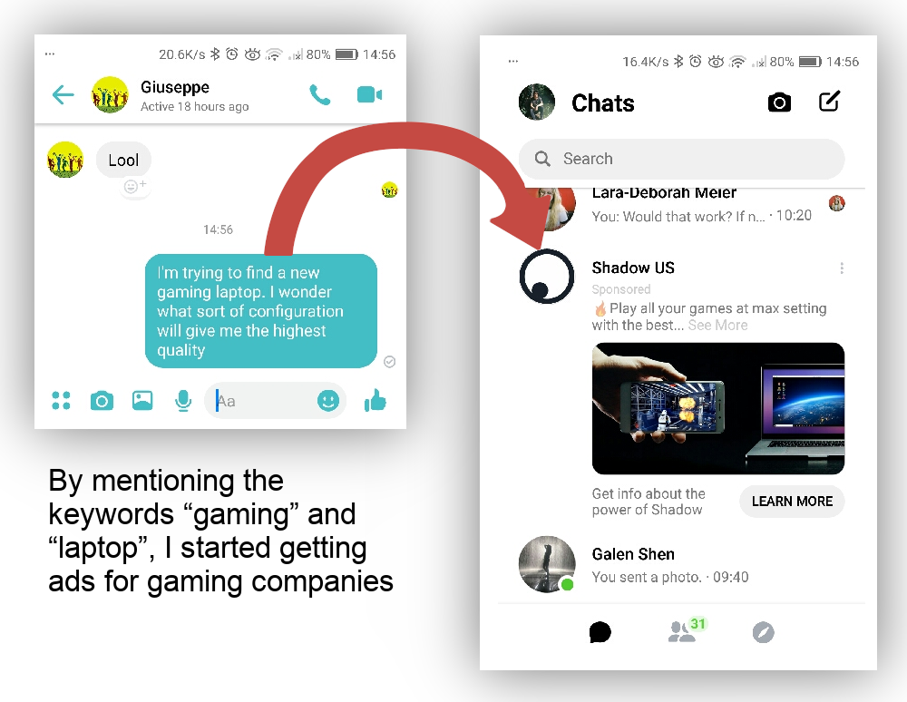
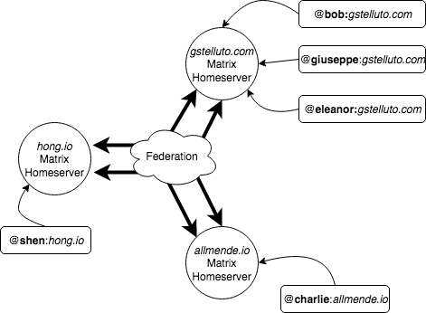
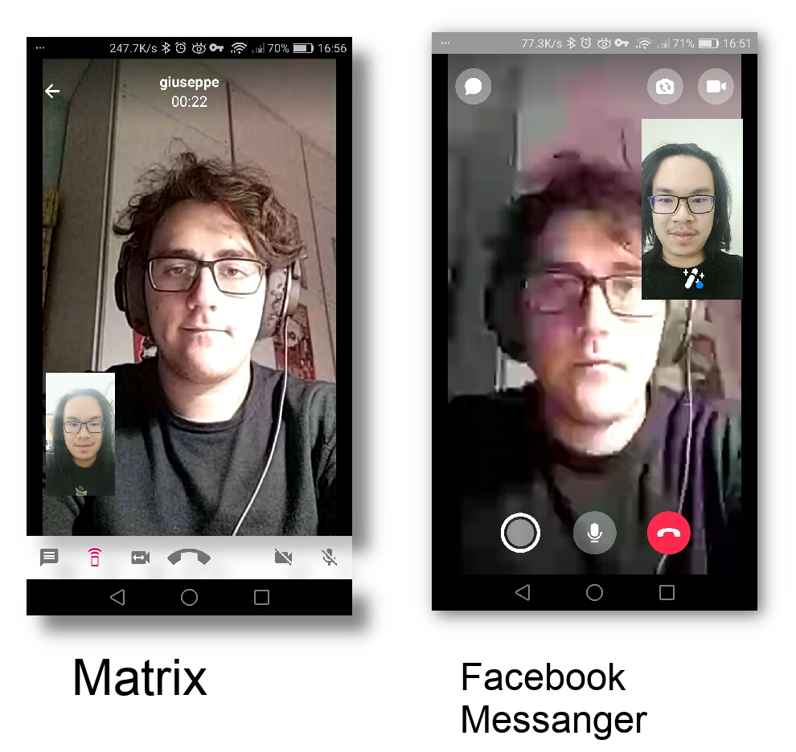
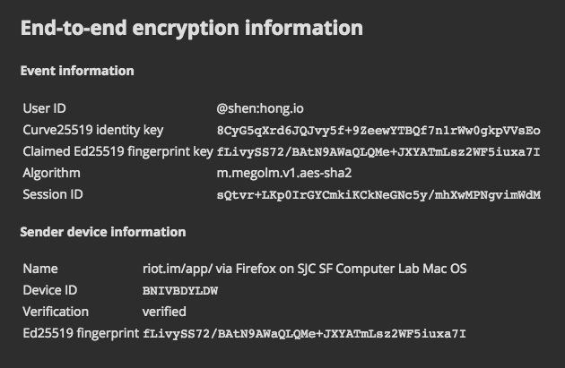
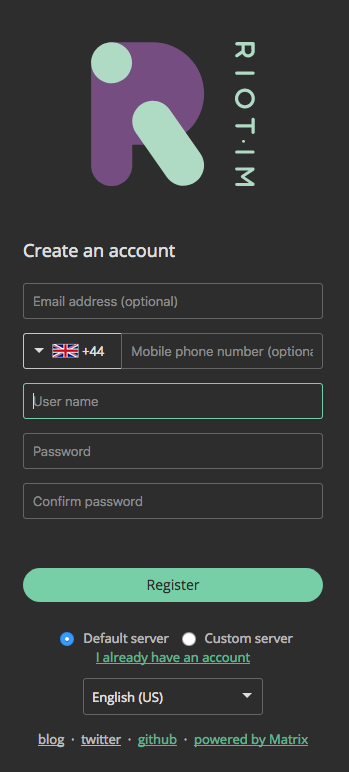
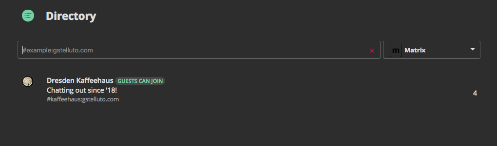
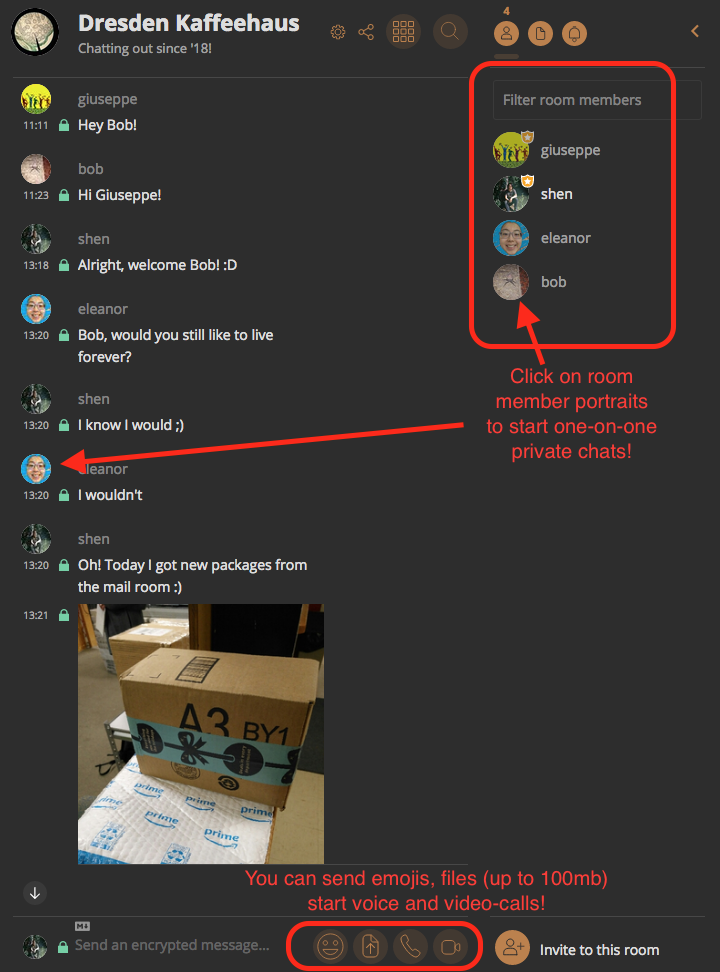

---
title: "Join us on Matrix!"
output:
  rmarkdown::pdf_document:
    fig_caption: no
    includes:
      in_header: preamble.tex
papersize: a4
...
Hi there! I’m Shen, and I co-authored this letter with Giuseppe, to help you join us on Matrix.

## What is Matrix?
Matrix is a free, open source chat system. You can use it to send messages, emojis, pictures, and videos – *as well as Voice and HD Video calls* with your friends. It’s available on Windows, Mac, iOS, and Android smartphones, and it is exceptionally safe and private.

## Why are you all on Matrix?
Giuseppe and I have made a resolution to move all of our communications to Matrix, and to use Facebook Messenger or WeChat as little as possible. Why? Because of the following reasons:

* **Matrix keeps your private conversations private**. Facebook, Google, Microsoft, and other large companies frequently monetize your personal information, in order to make money. Ever noticed how advertisements in Facebook Messenger would change depending on what you are talking about? That’s creepy, and it happens because Facebook is “mining” your personal correspondence, and selling it to advertisers. The same is done by many large companies which offer a “free” service.

* **Matrix is decentralized and federated**. Matrix is not a single company, or one app which holds all your personal information. But rather, Matrix is an open source standard – sort of like email. You don’t have to register a Gmail account in order to send or receive email. You can use yahoo, Hotmail, or even host your own – in fact, many companies or colleges host their own email (@uwcchina.org, anyone?). Matrix works in the same way, and when you make an matrix account, you can choose who to trust with your personal information, and seamlessly communicate with others across the matrix network (just like how a Gmail user can email an Hotmail user without problems).

* **Matrix has HD quality video-calls**. When you Video call someone on Skype or Facebook Messenger, your call is routed through networks that handles hundreds of thousands of calls in every given moment. *Because bandwidth (data) is limited (and expensive!), companies will not give you the best quality possible.* Giuseppe and I host our own Matrix servers, which only have dozens of users. This means, when you make a video call on Matrix, you will always get the best possible quality.

* **Matrix uses state-of-the-art encryption**. If you enable encryption in your Matrix chats (which is only a single button click), *nobody except the recipient of your messages can read your messages*. Not even the owners of your Matrix server! If you send someone a message on Facebook Messenger, Facebook can (and will) read your messages (in order to display advertisements). But an encrypted Matrix chat session means nobody else can eavesdrop.

## How do I join Matrix?
Looking forwards to give Matrix a try? In order to get started, you need to join an *Matrix homeserver* --- sort of like signing up for email at Gmail or Yahoo. Giuseppe is running a Matrix homeserver, and you are welcome to sign up with him!

1. Visit `https://riot.gstelluto.com/#/register`, and **choose a username and password**. *You do not have to provide an email or phone number*. Because *Giuseppe's homeserver is only for our close friends, most people use their first name as their username*.

2. Once you have logged in to your account, visit the *Room Directory* `https://riot.gstelluto.com/#/directory` and **join the Dresden Kaffeehaus!** That is the main chatroom for our Matrix community, and there you can find Giuseppe, myself, and everyone else :).

3. **Introduce yourself to everyone else**! Don't forget to add a profile picture! You can also start one-on-one private chats with members of the room, by clicking on their profile :)

## I'm on Matrix! Now what?

* **Hang out with your friends at The Dresden Kaffeehaus!** We'll all be sharing bits of our day in that main chatroom :)

* **Speak with your friends privately in your one-on-one chats.** You can create an infinite number of chat rooms with your friend. So you can have a group chat for a study group, a private chat for a partnership project, a private-chat for just memes... the possibilities are endless

* **Take advantage of HD video calls!** Call quality is significantly better than Skype and Facebook Messanger, and usually is restrained only by your internet speed, rather than artificially lowered to save bandwidth.

* **Send very large files!** Facebook Messenger only allows you to send files of 25.0 MB. On Matrix, you can send files up to 100.00 MB, up to 4 times as large!

* And in general, **enjoy a high quality chat experience where your data is in your control**, and not 'mined' for advertising, or sold to other companies.
